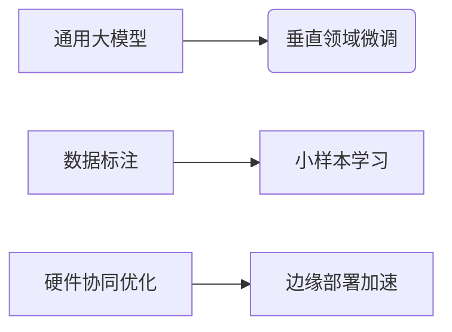

# AI进化论：2024年，我们站在智能革命的哪个路口？

2024年，人工智能不再是一个遥远的技术名词。它正以前所未有的速度渗透进我们的生活、工作与决策方式中。从硅谷到深圳，从医疗影像识别到自动驾驶，AI正在重构人类社会的基本逻辑。

## 技术演进：从“模型大战”走向“场景落地”

过去两年，大模型竞赛如火如荼。但到了2024年，行业开始冷静下来，焦点从参数规模转向**垂直领域适配能力**。

> 根据 IDC 数据，2024 年 Q1 中国企业对 AI 的投资中，有 **63% 投向行业专用模型**，而通用大模型仅占 27%。

这意味着：企业不再为“大”买单，而是为“准”付费。在制造业，华为云推出面向质检的轻量视觉模型，推理效率提升 5 倍；在金融领域，蚂蚁集团推出的风控专用 AI 模型将误判率降低了 40%。

## 能力迁移：AI 开始“懂业务”了

AI 正在跨越技术边界，进入真正的“业务融合期”。不再是简单的图像分类或文本生成，而是能理解流程、预测趋势、辅助决策。

### 医疗健康：AI 成为医生的“第二大脑”

2024 年初，阿里健康发布新一代 AI 辅诊系统，在三甲医院测试中达到：

- 疾病初筛准确率 92.3%
- 诊疗建议采纳率提升 38%
- 平均问诊时间缩短 22 分钟

这标志着 AI 不再是冷冰冰的工具，而是具备初步临床协作能力的“助手”。

### 制造业：从“看图识物”到“预知未来”

工业 AI 正从视觉检测迈向预测性维护。以树根互联为例，其基于 AI 的设备故障预警系统已覆盖超过 20 万台设备，平均提前 72 小时预警关键部件老化问题，帮助企业降低运维成本达 25%。

---

## 商业模式：AI 价值开始“变现”

AI 曾经是实验室里的“黑科技”，如今正逐步形成清晰的商业路径。根据麦肯锡《2024 全球 AI 报告》，AI 在以下领域的商业化进程显著加快：

| 行业 | AI 渗透率（2024） | 同比增长 |
|------|------------------|----------|
| 金融 | 67%              | +15%     |
| 医疗 | 58%              | +18%     |
| 零售 | 49%              | +20%     |
| 教育 | 32%              | +25%     |

值得关注的是，SaaS+AI 的模式正在崛起。Notion、ClickUp 等办公平台通过集成 AI 功能，ARPU 提升超 40%。国内厂商如飞书、钉钉也纷纷推出 AI 套件，推动企业服务进入“智能订阅”时代。

---

## 挑战与隐忧：AI 发展的“十字路口”

尽管前景光明，AI 仍面临多重挑战：

- **伦理与合规风险加剧**：欧盟 AI 法案实施后，全球 42 个国家启动 AI 监管立法；
- **算力成本高企不下**：训练一个千亿参数模型，仍需百万级美元投入；
- **人才缺口持续扩大**：中国信通院数据显示，AI 领域高端人才供需比仅为 1:10。

$$
\text{AI 成本公式} = \frac{\text{模型复杂度} \times \text{数据量}}{\text{硬件性能} \times \text{算法效率}}
$$

如何在这四个变量之间找到最优解，成为企业能否在 AI 竞争中胜出的关键。

---

## 未来展望：AI 将如何继续改变世界？

我们正站在一个转折点上：

- **多模态将成为标配**：文本、语音、图像、视频等信息将被统一建模；
- **AI Agent 构建新交互范式**：用户不再“使用”AI，而是“指挥”AI 完成任务；
- **本地化部署加速**：随着芯片性能提升，AI 将更多运行在终端设备上。

> “AI 的终局不是替代人类，而是重塑人机协作的方式。”——斯坦福 AI 实验室，2024 春季论坛

未来属于那些能够将 AI 与行业深度融合的企业。它们不追求最大模型、最高参数，而是用 AI 解决真实问题，创造可持续价值。

你准备好了吗？