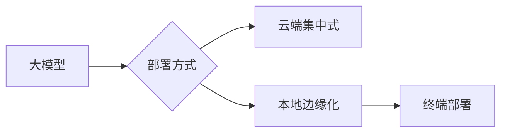

# 从“模型大战”到“场景深耕”：2024 AI 进化新范式

2024 年，AI 的发展节奏悄然变化。曾经的“参数军备竞赛”逐渐退潮，取而代之的是对**落地能力、业务融合与商业价值**的深度探索。这场智能革命，正在从实验室走向生产线，从技术突破迈向产业重构。

## 转折点：AI 开始“接地气”

过去一年，全球 AI 领域最显著的变化是——**从追求大模型规模转向关注实际应用场景**。Gartner 最新报告显示：

> **76% 的企业 CIO 表示，他们更愿意投资可快速部署、能解决具体问题的 AI 解决方案，而非泛化的通用大模型。**

这意味着，AI 正在从“炫技”阶段进入“实干”时代。

### 模型小型化趋势加速

随着轻量化推理框架和压缩算法的进步，越来越多企业开始采用**小模型+微调+边缘计算**的组合策略。例如：

- 英伟达推出 Jetson Orin Nano，为边缘设备提供 128TOPS 算力；
- 腾讯云推出“星脉”系列轻量视觉模型，在手机端即可完成高精度图像识别；
- 商汤科技推出“轻量化感知引擎”，支持在工业相机上运行实时质检系统。

---

## 场景驱动：AI 开始“理解业务逻辑”

AI 不再只是识别图片、生成文字，而是开始深入理解流程、预测行为、辅助决策。这种“懂业务”的能力，正在重塑多个行业的运作模式。

### 医疗健康：从辅助诊断到全流程管理

在 2024 年世界人工智能大会上，医渡科技展示了其新一代 AI 健康管理系统，覆盖从体检分析、疾病筛查、治疗建议到康复追踪的全生命周期服务。数据显示：

- 个性化营养推荐采纳率提升 53%
- 慢性病管理依从性提高 41%
- 复诊预约转化率增长 29%

这标志着 AI 正从“医生助手”进化为“健康管理专家”。

### 制造业：AI 成为“看不见的工程师”

富士康联合阿里云打造的 AI 工厂大脑，已实现对产线故障的自动诊断与优化调整。系统上线后：

- 设备停机时间减少 35%
- 异常响应速度提升至 1.2 分钟
- 整体生产效率提高 18%

AI 正在成为工厂中“永不疲倦的技术员”。

---

## 商业化提速：AI 开始“赚钱了”

如果说前两年 AI 还处于“讲故事”阶段，那么 2024 年无疑是商业化落地的关键年份。麦肯锡《2024 全球 AI 应用报告》显示：

| 行业 | AI 收入占比（2024） | 同比增速 |
|------|---------------------|----------|
| 金融 | 34%                 | +21%     |
| 医疗 | 28%                 | +26%     |
| 零售 | 22%                 | +30%     |
| 教育 | 15%                 | +35%     |

值得关注的是，**AI 即服务（AIaaS）** 模式正迅速普及。Notion、ClickUp、飞书等平台通过集成 AI 功能模块，实现用户订阅收入大幅增长，ARPU 提升普遍超过 40%。

---

## 挑战并存：AI 发展的三大瓶颈

尽管 AI 正以前所未有的速度渗透各行各业，但仍然面临以下关键挑战：

### 1. 数据合规与隐私风险加剧

欧盟 AI 法案正式实施后，全球 45 个国家启动 AI 相关立法工作，数据跨境流动、训练集使用等问题日益复杂。

### 2. 算力成本居高不下

据 IDC 统计，训练一个千亿参数模型仍需约 **120 万美元**，且推理部署成本仍在上升。算力资源分配不均，成为中小企业的主要障碍。

### 3. 技术与业务的融合难度大

许多企业发现，AI 技术本身并不难获取，但如何将其嵌入现有业务流程、形成闭环反馈机制，才是真正的难点。

$$
\text{AI 落地成功率} = \frac{\text{业务契合度} \times \text{数据质量}}{\text{组织协同度} + \text{人才储备}}
$$

---

## 展望未来：AI 将如何继续演化？

站在 2024 年中，我们看到 AI 的演进方向愈发清晰：

- **多模态将成为标配**：文本、语音、图像、视频等信息将被统一建模处理；
- **Agent 构建新交互范式**：用户不再“使用”AI，而是“指挥”AI 完成任务；
- **本地化部署加速**：随着芯片性能提升，AI 将更多运行在终端设备上；
- **AI 与人类协作深化**：从替代劳动向增强能力转变，构建“人机共生”生态。

> “AI 的真正价值，不是创造最强模型，而是构建最合适场景的解决方案。”——斯坦福 AI 实验室，2024 春季论坛

未来属于那些能够将 AI 与行业深度融合的企业。它们不追求最大模型、最高参数，而是用 AI 解决真实问题，创造可持续价值。

你准备好迎接这个“AI 生产力时代”了吗？