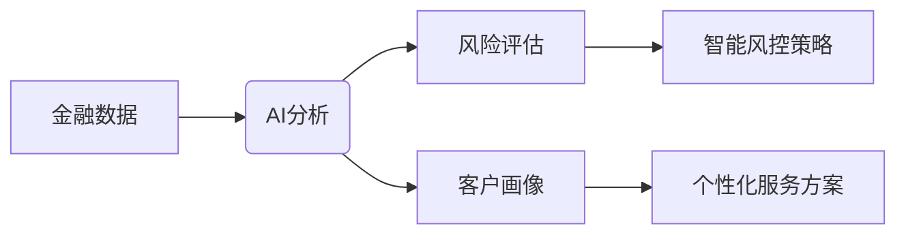

# AI浪潮：2024年重塑各行业新生态

在科技的浩瀚星空中，人工智能无疑是当下最为闪耀的那颗星。2024年，AI不再局限于科技爱好者的讨论范畴，而是以排山倒海之势席卷各个行业，重塑着全球经济与社会的格局。

## AI赋能金融：智能风控与个性化服务双剑合璧

金融行业向来对新技术有着敏锐的嗅觉，AI的融入更是让其如虎添翼。

### 智能风控：精准防范风险
传统的风控模式在面对日益复杂的金融环境时显得力不从心。而AI的出现为金融机构带来了新的曙光。据国际知名金融研究机构测算，2024年上半年，采用AI智能风控系统的银行，欺诈损失率平均降低了35%。以国内某大型银行为例，其引入的AI风控模型，通过对海量交易数据的实时分析和学习，能够精准识别异常交易行为，提前预警潜在风险，将风险防控的时效性和准确性提升到了一个新高度。

### 个性化服务：满足客户多元需求
如今，客户对金融服务的个性化要求越来越高。AI技术使得金融机构能够深入了解每个客户的需求和偏好。根据艾瑞咨询的数据，2024年有超过70%的金融机构通过AI为客户提供个性化的投资建议和理财产品推荐。比如招商银行的AI客服，能够根据客户的历史交易记录、资产状况等信息，为客户量身定制专属的金融服务方案，大大提高了客户的满意度和忠诚度。

## AI助力医疗：从辅助诊断到精准治疗

医疗领域是AI应用的重要战场，它正逐渐改变着传统的医疗模式。

### 辅助诊断：提高诊断效率与准确性
在医疗影像诊断方面，AI技术已经展现出了巨大的优势。以肺部疾病诊断为例，AI系统能够在短时间内对大量的CT影像进行分析，快速准确地检测出肺部的病变情况。相关研究表明，AI辅助诊断系统在肺癌早期筛查中的准确率高达90%以上，大大提高了疾病的早期发现率。国内的推想医疗等企业，凭借其先进的AI医疗影像诊断技术，已经在多家医院得到了广泛应用。

### 精准治疗：制定个性化治疗方案
AI结合基因测序技术，能够为患者制定更加精准的治疗方案。在癌症治疗领域，通过对患者的基因数据进行分析，AI可以帮助医生选择最适合患者的治疗药物和治疗方法。美国的一些研究机构利用AI技术进行癌症治疗方案的优化，使得部分癌症患者的治疗效果得到了显著提升。

## AI革新教育：开启个性化学习新时代

教育行业也在AI的推动下发生着深刻的变革。

### 个性化学习：满足不同学生的需求
传统的教育模式往往难以满足每个学生的个性化需求。而AI技术的应用使得个性化学习成为可能。通过对学生的学习数据进行分析，AI可以为每个学生制定专属的学习计划。据统计，2024年采用AI个性化学习系统的学校，学生的学习成绩平均提高了15%。比如作业帮等在线教育平台，利用AI技术为学生提供个性化的学习辅导，深受学生和家长的欢迎。

### 智能教学：提升教学质量与效率
AI还可以为教师提供智能教学辅助工具，帮助教师更好地开展教学工作。例如，AI智能批改作业系统能够快速准确地批改学生的作业，为教师节省了大量的时间和精力。同时，AI还可以根据学生的作业情况，为教师提供教学建议，帮助教师优化教学内容和方法。

## 挑战与机遇并存：AI发展的必由之路

尽管AI在各行业的应用前景广阔，但也面临着一些挑战。

- **数据安全与隐私问题**：随着AI的广泛应用，数据的安全与隐私问题日益凸显。如何保护用户的数据不被泄露和滥用，是AI发展过程中必须解决的问题。
- **伦理道德问题**：AI的决策过程往往缺乏透明度，这可能会引发一些伦理道德问题。例如，在医疗领域，AI辅助诊断系统的决策结果可能会影响患者的治疗方案，如何确保这些决策的公正性和合理性，是需要深入思考的问题。
- **人才短缺问题**：AI技术的发展需要大量的专业人才，但目前全球范围内AI人才短缺的问题较为严重。如何培养和吸引更多的AI人才，是推动AI产业发展的关键。

$$
\text{AI发展挑战公式} = \frac{\text{数据安全风险} + \text{伦理道德争议}}{\text{人才储备量} \times \text{技术创新能力}}
$$

然而，挑战与机遇总是并存的。随着技术的不断进步和政策的不断完善，AI将在更多领域得到广泛应用，为人类社会带来更多的福祉。

## 未来展望：AI引领人类走向新未来

展望未来，AI的发展前景十分广阔。

- **跨领域融合：创造更多可能性**：AI将与物联网、大数据、云计算等技术深度融合，创造出更多的应用场景和商业机会。例如，在智能家居领域，AI与物联网技术的结合将实现家居设备的智能化控制，为人们带来更加便捷舒适的生活体验。
- **自主学习与进化：实现更高层次的智能**：未来的AI将具备更强的自主学习和进化能力，能够不断适应新的环境和任务。这将使得AI在更多复杂的领域发挥重要作用，如星际探索、深海探测等。
- **普惠性发展：让更多人受益**：随着AI技术的不断普及和成本的不断降低，AI将惠及更多的人群和地区。无论是发达国家还是发展中国家，都将在AI的发展中受益。

“AI是人类科技发展的一次重大飞跃，它将带领我们走向一个更加美好的未来。”在这场AI的浪潮中，我们每个人都应该积极拥抱变化，抓住机遇，共同迎接AI时代的到来。 